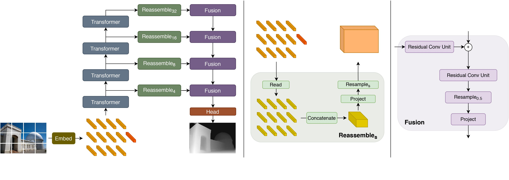
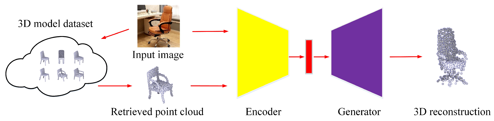
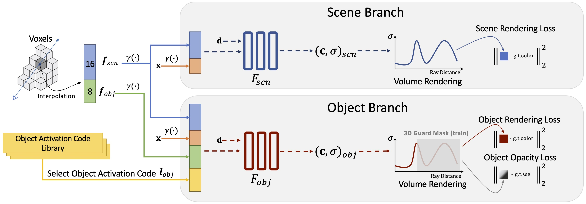
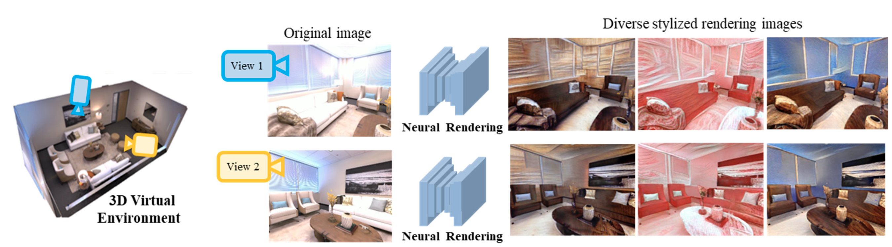
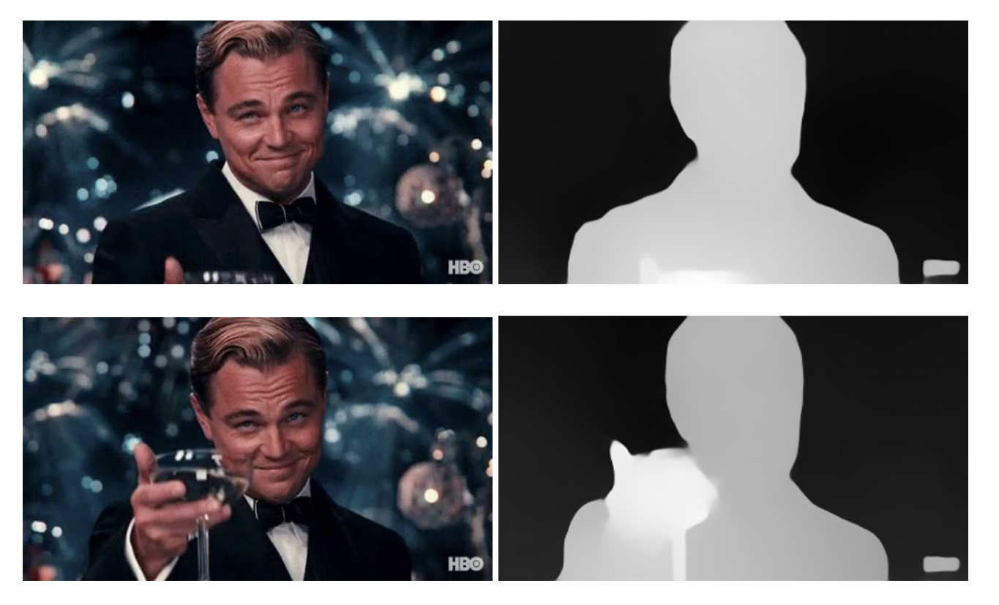
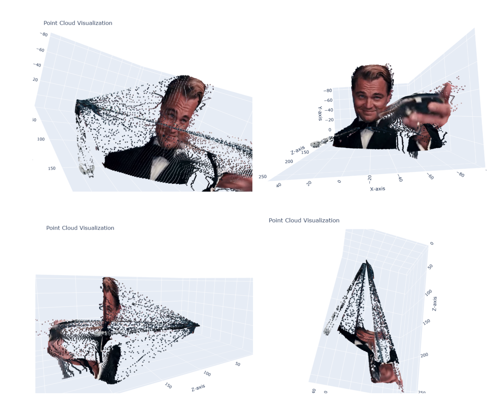

# **2D Video to 3D Scene Synthesis**
🔹 Transforming 2D videos into immersive 3D scenes using deep learning and depth estimation.

<p align="center"> 
  
</p>

---

## 📝 Overview
This project aims to convert **monocular 2D video** into **3D scene representations** using **depth estimation, point cloud generation, and neural rendering techniques**. It reconstructs depth information from a single-view video and renders a **realistic 3D environment** with smooth camera movements.

---

## ✨ Key Features
- ✅ **Monocular Depth Estimation** (MiDaS-based)  
- ✅ **Point Cloud Generation** (Open3D)  
- ✅ **Neural Network-Based Rendering**  
- ✅ **Depth-Aware Occlusion Handling**  
- ✅ **Real-Time 3D Scene Visualization**  

---

## 🔍 Motivation  
The demand for **3D content** is increasing in **AR/VR, gaming, and autonomous systems**. However, traditional **multi-camera setups** for 3D scene reconstruction are **expensive and impractical**. This project introduces an **efficient pipeline** that enables **2D-to-3D transformation using a single video source**.

### 🔹 Applications  
- ✔️ **Virtual Reality & Augmented Reality (VR/AR)**  
- ✔️ **Autonomous Navigation (Robotics, Self-Driving Cars)**  
- ✔️ **Digital Content Creation & Game Development**  
- ✔️ **Medical Imaging & 3D Reconstruction from Endoscopy Videos**  

---

## 🛠️ Methodology
This project follows an **end-to-end pipeline** to reconstruct **3D scenes** from **2D video frames**.


### **1️⃣ Depth Estimation**  
- Uses the **MiDaS depth estimation model** to predict **per-frame depth maps**.  
- The model processes each video frame and outputs a **depth map representing spatial structure**.

### 📌 **Depth Estimation Architecture**
<p align="center"> 
  
</p>

### **2️⃣ Point Cloud Generation**  
- Converts **depth maps** into **3D point clouds** using **intrinsic camera parameters**.  
- **Open3D** is used for **processing and rendering the point cloud**.  

### 📌 **Point Cloud Generation Architecture**
<p align="center"> 
  
</p>

### **3️⃣ 3D Scene Rendering**  
- **Neural rendering** is applied to generate **high-quality 3D images**.  
- **Depth-aware occlusion handling** ensures **realistic object overlap and perspective**.  

### 📌 **3D Scene Rendering Architecture**
<p align="center"> 
  
</p>

### **4️⃣ Camera Movement Simulation**  
- Generates **smooth 3D video** using a **dynamic camera trajectory** around the reconstructed scene.  
- **Gaussian smoothing** is applied to improve rendering quality.

### 📌 **Camera Movement Simulation Architecture**
<p align="center"> 
  
</p>

---

## 📊 Results & Evaluation  
The system successfully converts **2D videos** into **realistic 3D visualizations**.  
📌 **Visual Quality:** High-fidelity 3D reconstructions with smooth depth transitions.  

### 📌 **Sample Outputs:**

### **1️⃣ Depth Map Generation**  
<p align="center">
  
</p>

### **2️⃣ Point Cloud Visualization**  
<p align="center">
  
</p>

### **3️⃣ Final 3D Scene Rendering**  
<p align="center">
  
</p>

✅ **Smooth camera motion around 3D objects**  
✅ **Realistic depth perception and scene occlusion**  
✅ **Scalable for various video sources and camera angles**  

---

## 📥 Installation & Usage  

### 🔧 **Setup Instructions**
```bash
# Clone the repository
git clone https://github.com/JamunaSMurthy/2D-Video-to-3D-Synthesis.git
cd 2D-Video-to-3D-Synthesis

# Install dependencies
pip install -r requirements.txt
```
---
## ▶️ Running the Pipeline
```bash
python main.py --input video.mp4 --output output_3d.mp4
```
Arguments:

- input : Path to input 2D video.
- output : Path to save the generated 3D video.
⚙️ Implementation Details
---
📌 Frameworks & Tools Used:

- PyTorch - Neural network processing
- MiDaS - Depth estimation model
- Open3D - Point cloud visualization
- OpenCV - Video processing
- NumPy - Numerical computations

📌 Hardware Requirements:

- ✅ NVIDIA GPU (Recommended) for real-time processing
- ✅ Compatible with Google Colab for cloud execution

---

## 🔬 Future Enhancements

🚀 Planned Improvements:

- ✔️ Support for Real-Time Processing
- ✔️ Multi-View Synthesis for Enhanced 3D Realism
- ✔️ Integration with Neural Radiance Fields (NeRF)
---
📜 Citation & References

If you use this work, please cite this repository:

```bash
@misc{JamunaSMurthy2025,
  author = {Jamuna S Murthy},
  title = {2D Video to 3D Scene Synthesis Using Depth Estimation and Rendering},
  year = {2025},
  howpublished = {\url{https://github.com/JamunaSMurthy/2D-Video-to-3D-Synthesis/}},
  note = {GitHub repository}
}
```

📖 Related Works:

### 1️⃣MiDaS: Vision Transformers for Depth Estimation – GitHub (https://github.com/isl-org/MiDaS)
### 2️⃣ Open3D: 3D Data Processing Library – Website(https://www.open3d.org)
### 3️⃣ Neural Radiance Fields (NeRF) for View Synthesis – Paper(https://arxiv.org/abs/2003.08934)

👨‍💻 Contributors

@JamunaSMurthy
🚀 Feel free to contribute to this repository by submitting issues or pull requests!

⭐ Support & Feedback

If you find this project useful, please ⭐ star this repository and share your feedback!


